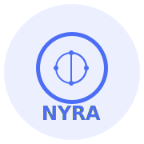
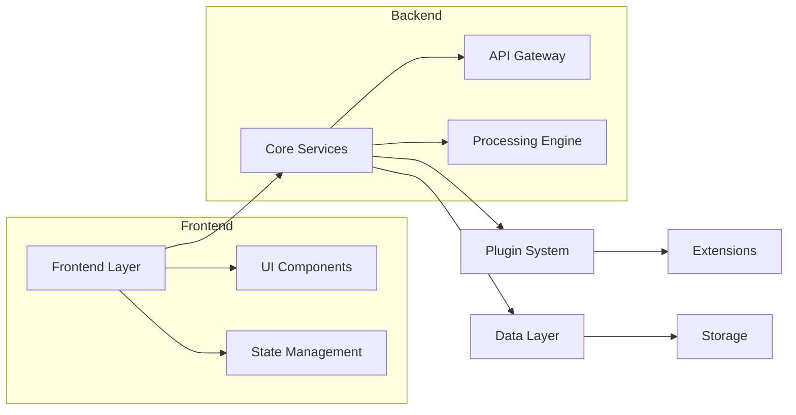
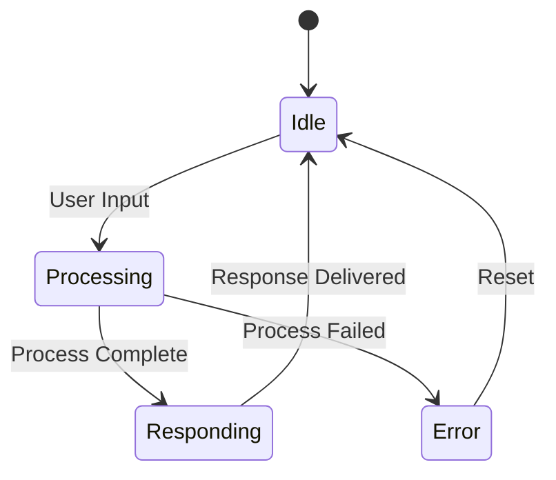

# 🧠 NYRA - Minds aligned. Possibilities unleashed.

<div align="center">
  
  
  [](https://www.typescriptlang.org/)
  [](https://reactjs.org/)
  [](https://mantine.dev/)
  [](LICENSE)
</div>

## 📋 Table of Contents

- [Overview](#-overview)
- [Features](#-features)
- [Architecture](#-architecture)
- [Technology Stack](#-technology-stack)
- [Project Structure](#-project-structure)
- [Getting Started](#-getting-started)
- [Development](#-development)
- [Contributing](#-contributing)
- [License](#-license)

## 🌟 Overview

Nyra is an advanced conversational system that continuously evolves to meet user demands. It combines natural interaction with an adaptive and self-creative visual interface, shaping itself to needs in real-time. Nyra doesn't just respond; it designs proactive experiences and solutions, aligning intelligence, visualization, and extensibility.

### Vision

Nyra represents the fusion between mind and technology, offering:
- **Continuous Learning**: Predicts and adapts to user needs
- **Visual Evolution**: Modular interface that evolves with context
- **Unlimited Potential**: Extensible functionality from graphs to complex simulations

## 🎯 Features

### Core Capabilities

1. **Intelligent Core**
   - Intent Management
   - Predictive Analysis
   - Dynamic Plugin System

2. **Adaptive Canvas**
   ```mermaid
   graph TD
     A[User Input] --> B[Intent Analysis]
     B --> C[Canvas Adaptation]
     C --> D[Visual Components]
     D --> E[Interactive Elements]
     E --> F[User Feedback]
     F --> A
   ```

3. **Visualization Suite**
   - Real-time Data Charts
   - Code Editor with Multi-language Support
   - File Management System
   - Image Processing

### User Experience

1. **Interactive Interface**
   - Natural Language Processing
   - Context-aware Responses
   - Dynamic Visualizations

2. **Extensibility**
   - Plugin Architecture
   - Custom Visualizations
   - API Integrations

## 🏗 Architecture

### System Overview



### Component Architecture

```
src/
├── components/
│   ├── Canvas/           # Main interaction area
│   ├── Visualization/    # Data visualization
│   ├── CodeEditor/       # Code editing
│   └── FileUpload/       # File management
├── core/
│   ├── intent/          # Intent processing
│   ├── plugins/         # Plugin system
│   └── state/           # State management
└── utils/
    ├── api/            # API utilities
    └── helpers/        # Helper functions
```

## 🛠 Technology Stack

### Frontend
- **React 18**: UI framework
- **TypeScript**: Type safety
- **Mantine**: UI components
- **Framer Motion**: Animations
- **Monaco Editor**: Code editing
- **Recharts**: Data visualization

### Development Tools
- **Vite**: Build tool
- **ESLint**: Code linting
- **Prettier**: Code formatting
- **Jest**: Testing
- **Storybook**: Component development

## 🚀 Getting Started

1. **Clone the Repository**
   ```bash
   git clone https://github.com/yourusername/nyra.git
   cd nyra
   ```

2. **Install Dependencies**
   ```bash
   npm install
   ```

3. **Start Development Server**
   ```bash
   npm run dev
   ```

4. **Build for Production**
   ```bash
   npm run build
   ```

## 💻 Development

### Code Structure

```typescript
// Component Example
interface ComponentProps {
  data: DataType;
  onAction: (data: ActionData) => void;
}

function Component({ data, onAction }: ComponentProps) {
  // Implementation
}
```

### State Management



### Plugin System

```typescript
interface Plugin {
  id: string;
  type: PluginType;
  execute: (data: any) => Promise<any>;
}

class PluginManager {
  // Plugin management implementation
}
```

## 🤝 Contributing

1. Fork the repository
2. Create your feature branch
   ```bash
   git checkout -b feature/amazing-feature
   ```
3. Commit your changes
   ```bash
   git commit -m 'Add amazing feature'
   ```
4. Push to the branch
   ```bash
   git push origin feature/amazing-feature
   ```
5. Open a Pull Request

## 📄 License

This project is licensed under the MIT License - see the [LICENSE](LICENSE) file for details.

---

<div align="center">
  <p>Built with ❤️ by the Nyra Team</p>
  <p>
    <a href="https://github.com/yourusername/nyra">GitHub</a> ·
    <a href="https://nyra.dev">Website</a> ·
    <a href="https://docs.nyra.dev">Documentation</a>
  </p>
</div>
